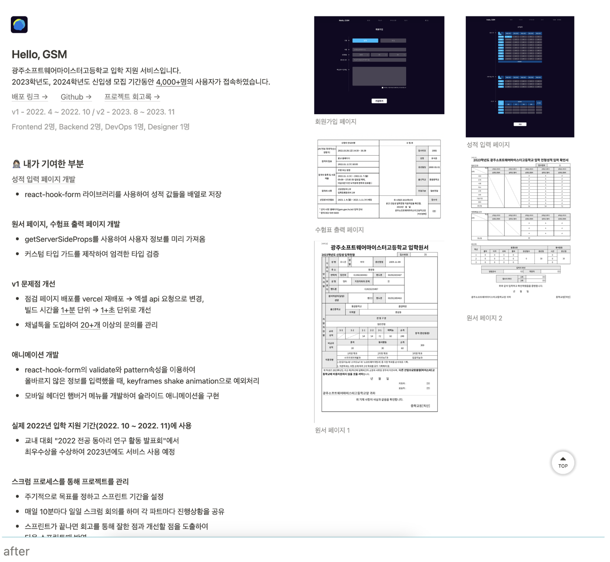
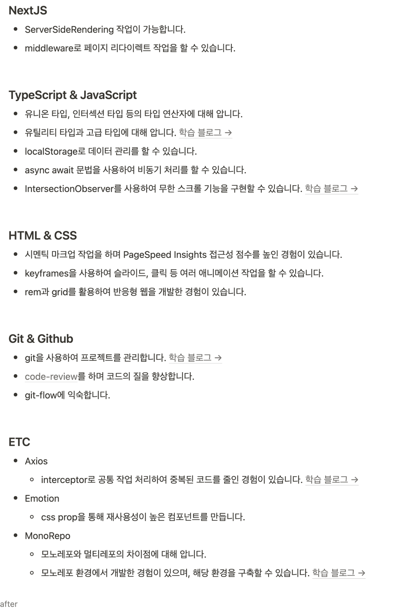

## 1. 개요 작성
포트폴리오의 첫 부분에는 간단한 자기소개와 개요를 작성합니다.

 - 이름, 연락처, 이메일, GitHub 링크, LinkedIn 프로필 등을 포함하세요.
 - 간략한 자기소개와 목표를 작성합니다.
## 2. 프로젝트 선택
가장 자신 있는 프로젝트를 선택하여 포트폴리오에 포함합니다.
 - 각 프로젝트는 하나의 섹션으로 나누어 설명합니다.
 - 최소 3개 이상의 프로젝트를 포함하되, 5개를 넘지 않도록 합니다.
## 3. 프로젝트 설명
각 프로젝트에 대해 다음과 같은 정보를 포함합니다.

 - 프로젝트 이름 및 설명: 프로젝트의 간략한 설명과 주요 기능을 적습니다.
 - 기여도: 팀 프로젝트라면 본인의 기여도를 명확히 작성합니다.
 - 기술 스택: 사용한 프로그래밍 언어, 프레임워크, 라이브러리 등을 나열합니다.
 - 개발 과정: 프로젝트를 개발하게 된 계기, 개발 중 직면했던 문제와 해결 방법, 프로젝트의 결과 등을 상세히 적습니다.
 - 코드 예시: 중요한 부분의 코드 스니펫을 포함합니다. (주석 및 설명 포함)
 - 데모 링크 및 GitHub 레포지토리 링크: 가능한 경우 프로젝트의 실행 데모 링크와 코드 저장소 링크를 첨부합니다.
 - 스크린샷 및 이미지: 프로젝트의 주요 화면이나 결과물을 시각적으로 보여줍니다.
## 4. 기술 스택 및 능력
본인의 기술 스택을 명확히 나열합니다.
 - 프로그래밍 언어 (예: Python, JavaScript)
 - 프레임워크 및 라이브러리 (예: React, Django)
 - 데이터베이스 (예: MySQL, MongoDB)
 - 기타 도구 및 기술 (예: Git, Docker)
## 5. 학습 및 경험
본인의 학습 경험과 추가적인 활동을 작성합니다.

 - 수강한 온라인 강의, 참여한 부트캠프, 독학한 내용 등을 나열합니다.
 - 관련된 인턴십, 워크숍, 해커톤 경험이 있다면 포함합니다.
## 6. 연관 프로젝트 및 기여
오픈소스 프로젝트에 기여한 경험이 있다면 작성합니다.

 - 기여한 프로젝트의 이름과 본인의 기여 내용을 상세히 적습니다.
 - 관련 링크를 첨부합니다.
## 7. 포맷 및 디자인
포트폴리오의 시각적 요소도 중요합니다.

 - 일관된 포맷과 디자인을 유지합니다.
 - 가독성을 높이기 위해 적절한 서식(헤더, 볼드체, 리스트 등)을 사용합니다.
 - 깔끔하고 직관적인 레이아웃을 선택합니다.
## 8. 검토 및 피드백
   포트폴리오를 작성한 후, 검토하고 피드백을 받습니다.

 - 자신이 작성한 포트폴리오를 몇 번이고 읽어보며 오타와 오류를 수정합니다.
 - 동료나 멘토에게 피드백을 요청합니다.

프로젝트 소개 샘플입니다

기슬 스택 샘플입니다

